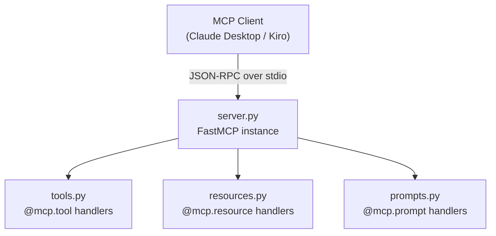
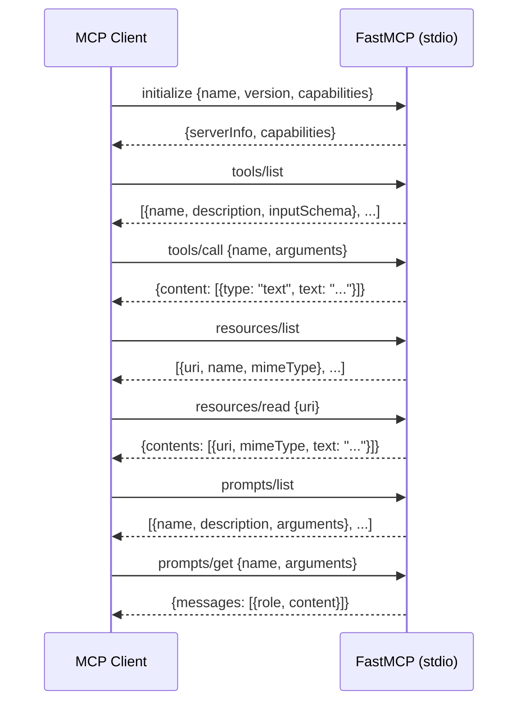

# Design Document: simple-mcp-server

## Overview

A learning-focused MCP server implemented in Python using the official `mcp` SDK (`FastMCP` high-level interface). The server exposes two tools, one resource, and one prompt as concrete, well-commented examples of each MCP primitive. It runs over stdio by default (for direct integration with Claude Desktop and Kiro) and optionally over HTTP/SSE.

The primary design goal is **clarity over cleverness**: every file should be short, self-contained, and heavily commented so a developer new to MCP can read it top-to-bottom and understand what is happening and why.

### Key Research Findings

- The official `mcp` Python SDK ([modelcontextprotocol/python-sdk](https://github.com/modelcontextprotocol/python-sdk)) ships `FastMCP`, a decorator-based high-level API that handles protocol compliance, JSON-RPC routing, capability advertisement, and error serialization automatically.
- `FastMCP` supports three transports: `stdio` (default), `sse` (legacy HTTP), and `streamable-http` (recommended for production HTTP). For local AI tool integration, `stdio` is the correct choice.
- Logs and debug output must go to `stderr` (not `stdout`) when running over stdio, because stdout is the JSON-RPC channel. `FastMCP` handles this automatically.
- Tools, resources, and prompts are registered via `@mcp.tool()`, `@mcp.resource()`, and `@mcp.prompt()` decorators. Python type annotations drive JSON Schema generation automatically.
- Error handling: unhandled exceptions inside tool handlers are caught by `FastMCP` and returned as structured MCP error responses; the server process does not crash.
- The recommended project manager is `uv` (PEP 517 compliant, fast), though `pip` + `venv` also works.

---

## Architecture

The server follows a **flat modular layout**: a thin entry-point (`server.py`) creates the `FastMCP` instance and imports capability modules that register their handlers via decorators. There is no framework beyond the SDK itself.

```
simple-mcp-server/
├── server.py          # Entry point — creates FastMCP instance, imports modules, calls mcp.run()
├── tools.py           # Tool definitions (@mcp.tool decorators)
├── resources.py       # Resource definitions (@mcp.resource decorators)
├── prompts.py         # Prompt definitions (@mcp.prompt decorators)
├── pyproject.toml     # Project metadata and dependencies (uv-managed)
├── README.md          # Setup, run, and integration guide
└── docs/
    └── adr/
        ├── 001-use-python-mcp-sdk.md
        ├── 002-stdio-as-primary-transport.md
        └── 003-modular-file-structure.md
```

### Component Interaction



### Transport Flow (stdio)



---

## Components and Interfaces

### `server.py` — Entry Point

Responsibilities:
- Instantiate `FastMCP` with server name and version.
- Import `tools`, `resources`, and `prompts` modules (side-effect: decorators register handlers).
- Call `mcp.run()` with the configured transport.
- Accept a `--transport` CLI flag (`stdio` | `sse`) defaulting to `stdio`.

```python
from mcp.server.fastmcp import FastMCP

mcp = FastMCP("simple-mcp-server", version="0.1.0")

# Import modules so their @mcp.tool / @mcp.resource / @mcp.prompt
# decorators fire and register handlers on the shared `mcp` instance.
import tools      # noqa: F401, E402
import resources  # noqa: F401, E402
import prompts    # noqa: F401, E402

if __name__ == "__main__":
    mcp.run()  # defaults to stdio
```

### `tools.py` — Tool Definitions

Two example tools are provided:

| Tool | Description | Inputs | Output |
|---|---|---|---|
| `add` | Adds two integers | `a: int`, `b: int` | `int` result as text |
| `get_weather` | Returns mock weather for a city | `city: str` | JSON-like text summary |

`FastMCP` derives the JSON Schema for each tool from Python type annotations. Docstrings become the `description` field.

### `resources.py` — Resource Definitions

One example resource:

| URI | Name | MIME Type | Description |
|---|---|---|---|
| `info://server` | Server Info | `text/plain` | Returns a human-readable summary of the server's capabilities |

Resources use the `@mcp.resource(uri)` decorator. The function return value (a string) becomes the resource content.

### `prompts.py` — Prompt Definitions

One example prompt:

| Name | Description | Arguments |
|---|---|---|
| `explain_concept` | Generates a prompt asking an LLM to explain a technical concept | `concept: str` (required), `level: str` (optional, default `"beginner"`) |

Prompts return a list of `Message` objects (role + content). `FastMCP` serializes these into the `prompts/get` response.

---

## Data Models

### MCP Primitive Representations (SDK types)

The `mcp` SDK defines these types in `mcp.types`. The server uses them implicitly through `FastMCP` decorators, but understanding them is important for learning.

```
Tool
  name: str                  # unique identifier
  description: str           # human-readable, shown to the LLM
  inputSchema: dict          # JSON Schema object (auto-generated from type hints)

Resource
  uri: AnyUrl                # unique identifier, e.g. "info://server"
  name: str                  # human-readable label
  mimeType: str              # e.g. "text/plain", "application/json"

Prompt
  name: str                  # unique identifier
  description: str           # human-readable
  arguments: list[PromptArgument]
    PromptArgument
      name: str
      description: str
      required: bool

PromptMessage
  role: "user" | "assistant"
  content: TextContent | ImageContent | EmbeddedResource
    TextContent
      type: "text"
      text: str
```

### Tool Input Schemas (auto-generated by FastMCP)

**`add` tool:**
```json
{
  "type": "object",
  "properties": {
    "a": {"type": "integer", "description": "First number"},
    "b": {"type": "integer", "description": "Second number"}
  },
  "required": ["a", "b"]
}
```

**`get_weather` tool:**
```json
{
  "type": "object",
  "properties": {
    "city": {"type": "string", "description": "City name to get weather for"}
  },
  "required": ["city"]
}
```

### Error Response Shape (JSON-RPC)

```json
{
  "jsonrpc": "2.0",
  "id": 1,
  "error": {
    "code": -32601,
    "message": "Method not found: unknown/method"
  }
}
```

MCP error codes used:
- `-32700` — Parse error (malformed JSON)
- `-32601` — Method not found
- `-32602` — Invalid params (schema validation failure)
- `-32603` — Internal error (unhandled exception in handler)

---

## Correctness Properties

*A property is a characteristic or behavior that should hold true across all valid executions of a system — essentially, a formal statement about what the system should do. Properties serve as the bridge between human-readable specifications and machine-verifiable correctness guarantees.*

### Property 1: `add` tool arithmetic correctness

*For any* pair of integers `a` and `b`, calling the `add` tool handler with `(a, b)` SHALL return a value equal to `a + b`.

**Validates: Requirements 2.3**

---

### Property 2: `get_weather` tool returns non-empty result for any city

*For any* non-empty string `city`, calling the `get_weather` tool handler SHALL return a non-empty string result.

**Validates: Requirements 2.3**

---

### Property 3: Unknown handler name raises error with non-empty message

*For any* string that is not a registered tool name, resource URI, or prompt name, calling the corresponding handler SHALL raise an exception whose message is non-empty. This property consolidates error-handling correctness across all three primitive types.

**Validates: Requirements 2.4, 3.4, 4.4, 6.4**

---

### Property 4: Resource read round-trip

*For any* URI that appears in the registered resource list, calling the resource read handler with that URI SHALL return a non-empty content string, and the declared `mimeType` SHALL be non-empty.

**Validates: Requirements 3.3**

---

### Property 5: Prompt get embeds concept in output messages

*For any* non-empty string `concept` and any `level` value, calling the `explain_concept` prompt handler SHALL return at least one message whose text content contains the value of `concept`.

**Validates: Requirements 4.3**

---

## Error Handling

### Strategy

`FastMCP` provides automatic error handling at the protocol layer. The server's responsibility is to:

1. **Not swallow exceptions silently** — let them propagate to `FastMCP`, which converts them to structured error responses.
2. **Raise meaningful exceptions** with descriptive messages for known error cases (unknown tool name, unknown resource URI, unknown prompt name, invalid arguments).
3. **Never write to stdout** in tool/resource/prompt handlers — use `logging` (which goes to stderr) for debug output.

### Error Cases and Handling

| Scenario | Handler Behavior | MCP Response |
|---|---|---|
| Unknown tool name in `tools/call` | Raise `ValueError("Unknown tool: {name}")` | Error response, code `-32602` |
| Unknown resource URI in `resources/read` | Raise `ValueError("Unknown resource: {uri}")` | Error response, code `-32602` |
| Unknown prompt name in `prompts/get` | Raise `ValueError("Unknown prompt: {name}")` | Error response, code `-32602` |
| Unhandled exception in tool handler | Exception propagates; `FastMCP` catches it | Error response, code `-32603` |
| Malformed JSON from client | Handled entirely by `FastMCP` / SDK | Parse error, code `-32700` |
| Unsupported JSON-RPC method | Handled entirely by `FastMCP` / SDK | Method not found, code `-32601` |
| Missing required tool argument | Handled by `FastMCP` schema validation | Invalid params, code `-32602` |

### Logging

All log output uses Python's `logging` module directed to `stderr`. This ensures no protocol pollution on `stdout` during stdio transport. Example:

```python
import logging
logger = logging.getLogger(__name__)
logger.debug("Tool 'add' called with a=%d, b=%d", a, b)
```

---

## Testing Strategy

### Unit Tests

Unit tests cover specific examples and edge cases for each handler function. They call the handler functions directly (not through the MCP protocol layer) to keep tests fast and focused.

Focus areas:
- `add(a, b)` returns correct sum for positive, negative, and zero inputs.
- `get_weather(city)` returns a non-empty string for any city name.
- `read_server_info()` returns a non-empty string.
- `explain_concept(concept, level)` returns a list with at least one message containing `concept`.
- Error cases: unknown tool name, unknown resource URI, unknown prompt name raise `ValueError`.

### Property-Based Tests

Property-based tests use [Hypothesis](https://hypothesis.readthedocs.io/) to verify universal properties across generated inputs. Each test runs a minimum of 100 iterations.

Each test is tagged with a comment referencing the design property it validates:
```
# Feature: simple-mcp-server, Property N: <property text>
```

**Properties to implement as Hypothesis tests:**

| Property | Test Strategy |
|---|---|
| Property 1: `add` arithmetic correctness | Generate random `int` pairs `(a, b)`; call `add(a, b)`; assert result == `a + b` |
| Property 2: `get_weather` non-empty result | Generate random non-empty city strings; call `get_weather(city)`; assert non-empty string returned |
| Property 3: Unknown handler raises error with message | Generate random strings not in registered names; call each handler; assert `ValueError` with non-empty message |
| Property 4: Resource read round-trip | For each registered URI, call read handler; assert non-empty content and non-empty mimeType |
| Property 5: Prompt get embeds concept | Generate random non-empty strings as `concept`; call `explain_concept(concept)`; assert concept in returned messages |

Registry completeness (tools list, resources list, prompts list) is verified as example-based unit tests since the registry is deterministic — running 100 iterations adds no value.

### Integration / Smoke Tests

- Start the server as a subprocess over stdio and perform a full `initialize` → `tools/list` → `tools/call` sequence using the `mcp` SDK's `ClientSession`.
- Verify the server does not write non-JSON to stdout.
- Verify the server process does not exit on a bad tool call.

### Test Layout

```
tests/
├── test_tools.py       # Unit + property tests for tool handlers
├── test_resources.py   # Unit + property tests for resource handlers
├── test_prompts.py     # Unit + property tests for prompt handlers
└── test_integration.py # Smoke test: full stdio round-trip via ClientSession
```
